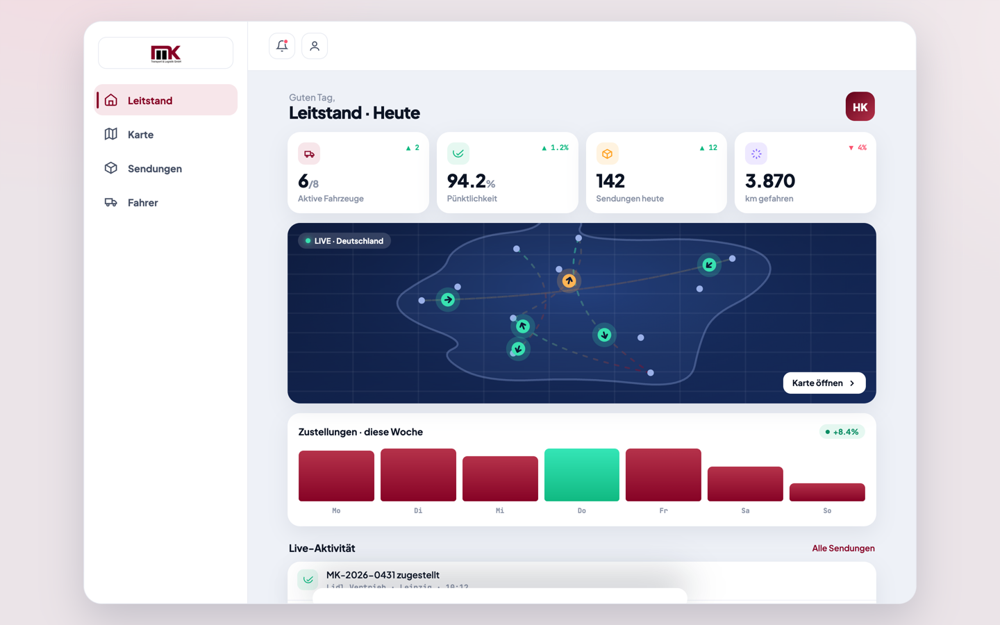
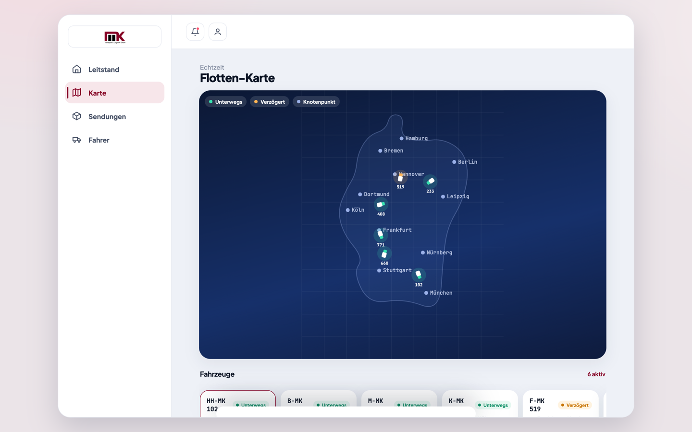
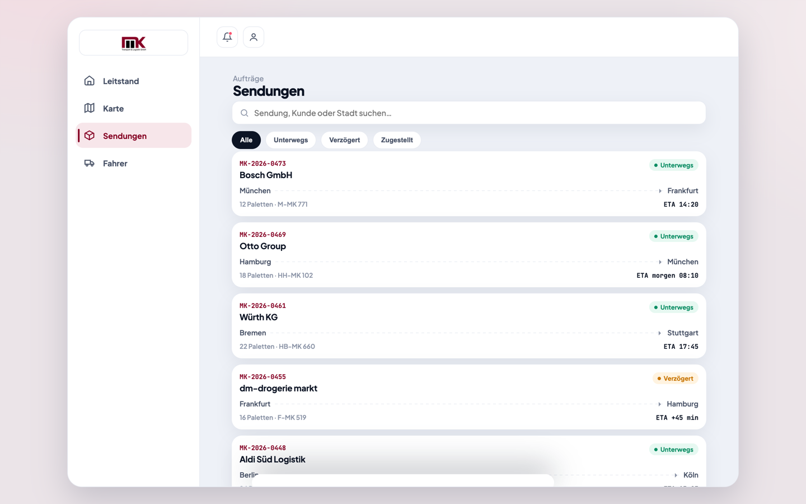
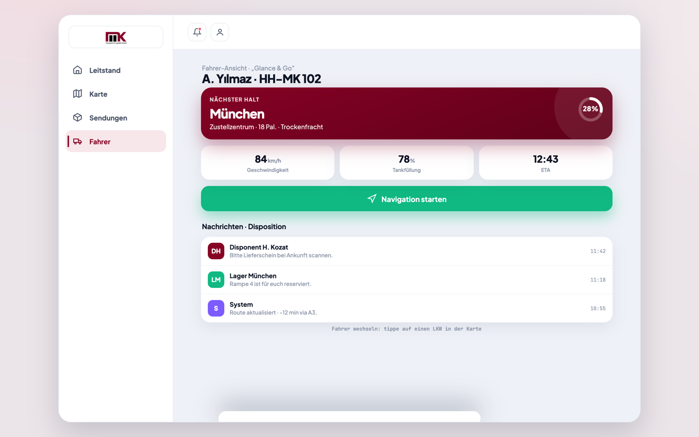
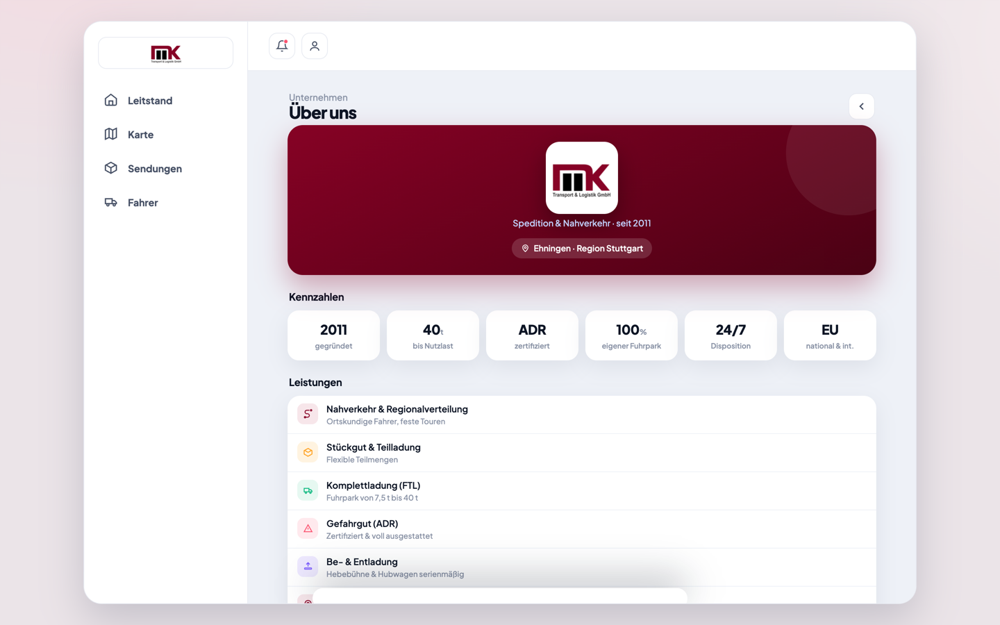

# MK Transport & Logistik GmbH — Flotten- & Liefermanagement

Interaktive Konzept-Demo eines Dispositions- und Flottenmanagement-Dashboards für eine
mittelständische Spedition. Eine einzelne, eigenständige HTML-Datei — kein Build, kein Backend,
kein Framework.

**▶ Live-Demo: https://haydarkozat.github.io/mk-logistik-demo/**



---

## Überblick

Disposition, Fahrer und Kunden brauchen dieselben Informationen — aber in sehr
unterschiedlicher Form. Die Demo zeigt eine Oberfläche, die genau das leistet: ein dichtes
Leitstand-Dashboard für die Disposition und daneben eine radikal reduzierte Fahreransicht
(„Glance & Go"), die im Fahrerhaus mit einem Blick erfassbar bleibt.

Umgesetzt für **MK Transport & Logistik GmbH** — Spedition & Nahverkehr seit 2011,
Ehningen in der Region Stuttgart.

## Demo-Bereiche

Vier Bereiche in der Seitenleiste — **Leitstand**, **Karte**, **Sendungen**, **Fahrer** —
sowie **Über uns** über das Profil-Symbol in der Kopfzeile.

### Leitstand

Kennzahlen des Tages (aktive Fahrzeuge, Pünktlichkeit, Sendungen, gefahrene Kilometer),
Wochenverlauf der Zustellungen, Vorschaukarte und ein Live-Aktivitätsstrom mit den
jüngsten Statusänderungen.

### Flotten-Karte



Alle Fahrzeuge mit Position und Status — unterwegs, verzögert, Knotenpunkt. Ein Klick auf
einen Lkw öffnet die Fahrzeugdetails; darunter läuft eine Leiste mit allen Fahrzeugen
und ihrem aktuellen Zustand.

### Sendungen



Auftragsliste mit Suche über Sendung, Kunde oder Stadt und Filtern nach Status
(Alle · Unterwegs · Verzögert · Zugestellt). Jede Sendung zeigt Relation, Palettenzahl,
Fahrzeug und ETA.

### Fahreransicht „Glance & Go"



Bewusst reduziert: nächster Halt, drei Kennzahlen (Geschwindigkeit, Tankfüllung, ETA),
ein großer Button für die Navigation und die Nachrichten der Disposition. Über die
Flotten-Karte lässt sich zwischen den Fahrern wechseln.

### Über uns



Unternehmensprofil mit Kennzahlen und Leistungen: Nahverkehr & Regionalverteilung,
Stückgut & Teilladung, Komplettladung (FTL), Gefahrgut (ADR), Be- & Entladung
(Hebebühne & Hubwagen serienmäßig) und Echtzeit-Tracking. Eigener Fuhrpark von
7,5 t bis 40 t, ADR-zertifiziert, EU-Lizenz national & international.

## Technik

Eine Datei, `index.html`, mit eingebettetem CSS und JavaScript — Vanilla, ohne Abhängigkeiten.
Grafiken sind als Data-URI eingebettet, Karte und Icons sind Inline-SVG. Einzige externe
Ressource sind die Schriften von Google Fonts (Plus Jakarta Sans, JetBrains Mono);
ohne Internetverbindung greift der System-Font-Stack. Ausgelegt für Desktop und Mobil.

## Lokal starten

Die Datei kann direkt im Browser geöffnet werden:

```bash
git clone https://github.com/haydarkozat/mk-logistik-demo.git
cd mk-logistik-demo
open index.html          # macOS · Linux: xdg-open · Windows: start
```

## Hinweis

Konzept-Demo zur Veranschaulichung der Oberfläche. Sämtliche Fahrzeuge, Sendungen,
Fahrernamen, Kennzahlen und Kundennamen sind frei erfundene Beispieldaten und stehen in
keinem Zusammenhang mit tatsächlichen Aufträgen oder Geschäftsbeziehungen. Es besteht
keine Anbindung an ein Telematik-, ERP- oder Tracking-System.

---

Konzipiert & entwickelt von **Haydar Kozat**
